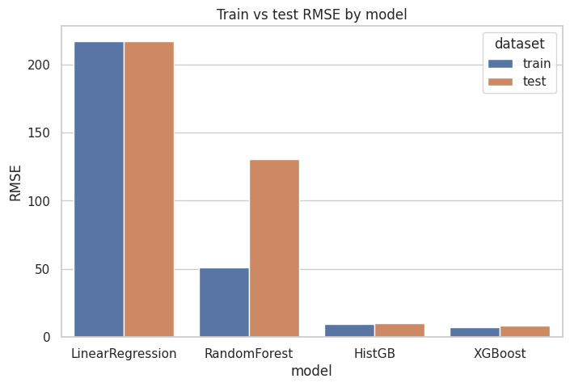
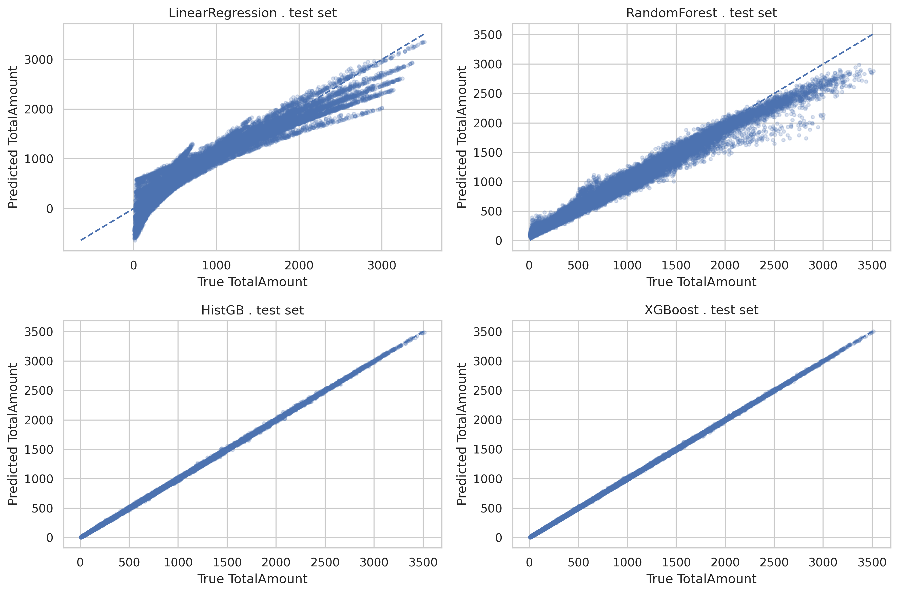
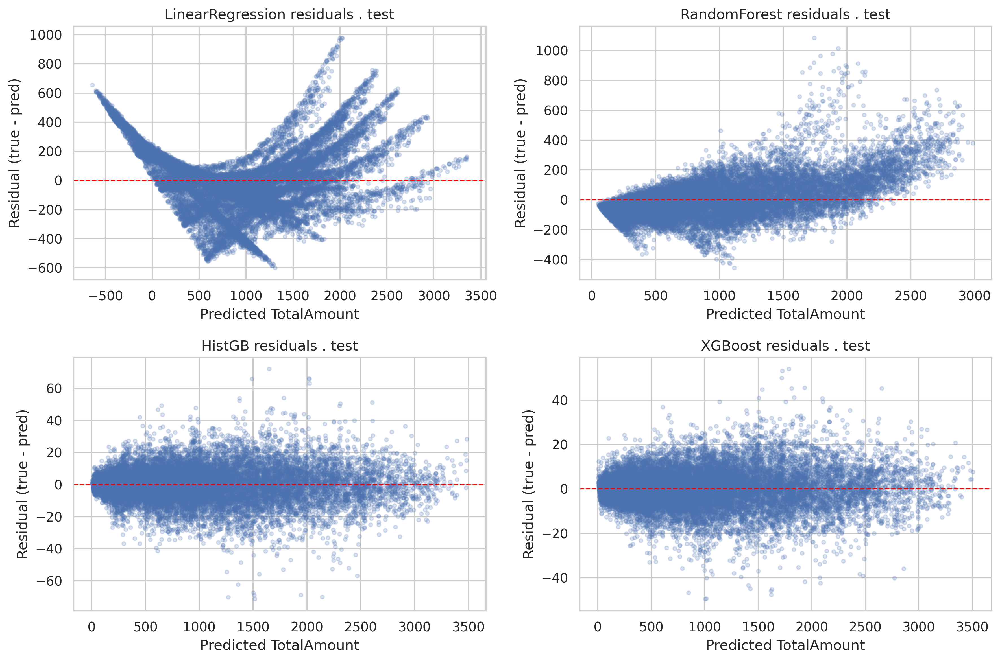
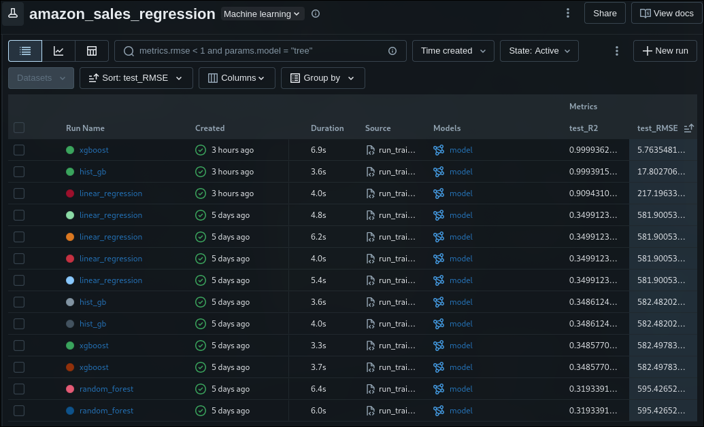

<p align="center">
  <h1 align="center">🛒 Amazon Sales MLOps</h1>
  <p align="center">
    <strong>End-to-End Machine Learning Operations Pipeline for Sales Prediction</strong>
  </p>
  <p align="center">
    <a href="#-quick-start">Quick Start</a> •
    <a href="#-architecture">Architecture</a> •
    <a href="#-features">Features</a> •
    <a href="#-model-performance">Model Performance</a> •
    <a href="#-api-reference">API Reference</a>
  </p>
</p>

<p align="center">
  
  
  
  
  
  
</p>

---

## 📋 Table of Contents

- [Overview](#-overview)
- [Project Structure](#-project-structure)
- [Architecture](#-architecture)
- [Features](#-features)
- [Quick Start](#-quick-start)
- [Model Performance](#-model-performance)
- [MLflow Experiment Tracking](#-mlflow-experiment-tracking)
- [API Reference](#-api-reference)
- [Docker Deployment](#-docker-deployment)
- [Testing](#-testing)
- [Configuration](#-configuration)
- [Tech Stack](#-tech-stack)

---

## 🎯 Overview

**Amazon Sales MLOps** is a production-ready machine learning pipeline that predicts total sales amounts for e-commerce transactions. This project demonstrates industry-standard MLOps practices including:

- **Experiment Tracking** — All training runs logged to MLflow with metrics, parameters, and artifacts
- **Model Registry** — Champion/Challenger pattern for model versioning and deployment
- **Quality Gates** — Automated model validation before production deployment
- **REST API** — FastAPI-powered prediction service with Swagger documentation
- **Interactive UI** — Streamlit dashboard for real-time predictions
- **Containerization** — Docker-ready for seamless deployment

### The Problem

Predicting `TotalAmount` for Amazon sales orders based on features like:
- Product attributes (Category, Brand, UnitPrice)
- Order details (Quantity, Discount, Tax, ShippingCost)
- Customer location (City, State, Country)
- Temporal features (OrderYear, OrderMonth, OrderDayOfWeek)

### The Solution

An **XGBoost regression model** achieving **R² = 0.9999** and **RMSE = 5.76** on the test set, deployed as a production API with champion/challenger model management.

---

## 📁 Project Structure

```
amazon-sales-mlops/
├── 📂 configs/                    # Configuration files
│   ├── config.yaml               # General settings
│   ├── registry.yaml             # Model registry & quality gates
│   └── best_model.yaml           # Best model reference (auto-generated)
│
├── 📂 data/
│   ├── raw/                      # Original dataset
│   │   └── amazon_sales.csv
│   └── processed/                # Feature-engineered data
│       └── amazon_sales_regression.csv
│
├── 📂 models/
│   └── champion.pkl              # Exported production model
│
├── 📂 mlruns/                    # MLflow experiment artifacts
│
├── 📂 notebooks/
│   ├── 01_eda.ipynb             # Exploratory Data Analysis
│   └── 02_model_baselines.ipynb # Model experimentation
│
├── 📂 scripts/                   # Automation scripts
│   ├── run_train.py             # Model training pipeline
│   ├── run_api.py               # Start FastAPI server
│   ├── run_ui.py                # Start Streamlit UI
│   ├── run_mlflow_ui.py         # Start MLflow dashboard
│   ├── register_best_models.py  # Model registry automation
│   ├── select_best_regression_run.py
│   └── export_model.py          # Export model for Docker
│
├── 📂 src/amazon_sales_ml/       # Main package
│   ├── api/
│   │   └── app.py               # FastAPI application
│   ├── models/
│   │   ├── train.py             # Training logic
│   │   ├── pipelines.py         # Sklearn pipelines
│   │   └── evaluate.py          # Evaluation utilities
│   ├── mlflow_utils/
│   │   └── tracking.py          # MLflow helpers
│   ├── ui/
│   │   ├── app.py               # Streamlit main app
│   │   ├── api_client.py        # API client
│   │   └── views/               # UI pages
│   └── config.py                # Path configurations
│
├── 📂 tests/                     # Unit tests
│   ├── test_api.py
│   └── test_model.py
│
├── 📂 assets/                    # Documentation images
│
├── 🐳 Dockerfile
├── 🐳 docker-compose.yml
├── 📄 pyproject.toml
├── 📄 requirements.txt
└── 📄 README.md
```

---

## 🏗 Architecture

```
┌─────────────────────────────────────────────────────────────────────────────┐
│                              MLOps Pipeline                                  │
├─────────────────────────────────────────────────────────────────────────────┤
│                                                                             │
│   ┌──────────────┐    ┌──────────────┐    ┌──────────────────────────────┐ │
│   │              │    │              │    │                              │ │
│   │  📊 Data     │───▶│  🔬 Training │───▶│  📈 MLflow Tracking          │ │
│   │  Processing  │    │  Pipeline    │    │  • Metrics (RMSE, R², MAE)   │ │
│   │              │    │              │    │  • Parameters                │ │
│   └──────────────┘    └──────────────┘    │  • Artifacts (model.pkl)     │ │
│                                           └──────────────┬───────────────┘ │
│                                                          │                 │
│                                                          ▼                 │
│                                           ┌──────────────────────────────┐ │
│                                           │                              │ │
│                                           │  🏆 Model Registry           │ │
│                                           │  • Quality Gates             │ │
│                                           │  • Champion/Challenger       │ │
│                                           │  • Version Control           │ │
│                                           └──────────────┬───────────────┘ │
│                                                          │                 │
│           ┌──────────────────────────────────────────────┼─────────────┐   │
│           │                                              │             │   │
│           ▼                                              ▼             │   │
│   ┌──────────────┐                            ┌──────────────────┐     │   │
│   │              │                            │                  │     │   │
│   │  🖥️ Streamlit │◀─────── HTTP ───────────▶│  ⚡ FastAPI      │     │   │
│   │  Dashboard   │                            │  Prediction API  │     │   │
│   │              │                            │                  │     │   │
│   └──────────────┘                            └──────────────────┘     │   │
│                                                                        │   │
│   ┌────────────────────────────────────────────────────────────────┐  │   │
│   │                      🐳 Docker Container                        │  │   │
│   └────────────────────────────────────────────────────────────────┘  │   │
│                                                                        │   │
└────────────────────────────────────────────────────────────────────────┘   │
```

### Data Flow

1. **Data Ingestion** → Raw CSV loaded and validated
2. **Feature Engineering** → Temporal features, encoding pipelines
3. **Model Training** → Multiple algorithms trained in parallel
4. **Experiment Tracking** → All runs logged to MLflow
5. **Model Selection** → Quality gates filter best models
6. **Registry** → Champion/Challenger models registered
7. **Deployment** → FastAPI serves predictions
8. **Monitoring** → Streamlit UI for interaction

---

## ✨ Features

### 🔬 Experiment Tracking with MLflow

- **Automatic logging** of all training runs
- **Metric comparison** across experiments
- **Artifact versioning** (models, plots, configs)
- **Run search** and filtering

### 🏆 Model Registry & Champion/Challenger Pattern

```yaml
# configs/registry.yaml
registry:
  regression_model_name: amazon_sales_totalamount_regressor
  
  # Quality Gates
  min_test_r2: 0.90          # Minimum R² threshold
  max_test_rmse: 250.0       # Maximum RMSE allowed
  max_generalization_gap_pct: 150.0  # Overfitting guard
  
  # Model Aliases
  champion_alias: champion   # Best production model
  challenger_alias: challenger  # Second-best for A/B testing
```

### ⚡ FastAPI Prediction Service

- **Single predictions** via `/predict`
- **Batch predictions** via `/predict_batch`
- **Model switching** between champion/challenger
- **Auto-generated Swagger docs** at `/docs`

### 🖥️ Streamlit Dashboard

- **Real-time predictions** with form inputs
- **Batch upload** via CSV
- **Model status** monitoring
- **Champion/Challenger** selection

### 🐳 Docker Ready

```bash
# Start all services
docker-compose up

# Access:
# - API: http://localhost:8000
# - UI:  http://localhost:8501
```

---

## 🚀 Quick Start

### Prerequisites

- Python 3.13+
- [uv](https://docs.astral.sh/uv/) (recommended) or pip

### Installation

#### Using uv (Recommended)

```bash
# Clone the repository
git clone https://github.com/yourusername/amazon-sales-mlops.git
cd amazon-sales-mlops

# Install dependencies
uv sync

# Activate virtual environment
source .venv/bin/activate
```

#### Using pip

```bash
# Clone the repository
git clone https://github.com/yourusername/amazon-sales-mlops.git
cd amazon-sales-mlops

# Create virtual environment
python -m venv .venv
source .venv/bin/activate

# Install dependencies
pip install -r requirements.txt
pip install -e .
```

### Train Models

```bash
# Run the training pipeline
uv run python scripts/run_train.py

# View results in MLflow UI
uv run python scripts/run_mlflow_ui.py
# Open http://localhost:5000
```

### Register Best Models

```bash
# Select best model
uv run python scripts/select_best_regression_run.py

# Register to Model Registry with quality gates
uv run python scripts/register_best_models.py
```

### Start the API

```bash
# Start FastAPI server
uv run python scripts/run_api.py

# API available at http://localhost:8000
# Swagger docs at http://localhost:8000/docs
```

### Launch the UI

```bash
# Start Streamlit dashboard
uv run python scripts/run_ui.py

# UI available at http://localhost:8501
```

---

## 📊 Model Performance

### My Approach to Finding the Best Model

When I started this project, I had one clear question: *which algorithm would give me the most reliable predictions for sales amounts?* I didn't want to just pick something popular and hope for the best. I wanted to test multiple approaches, measure them fairly, and let the data tell me which one actually works.

So I set up an experiment. I took four different regression algorithms — each with its own strengths and philosophy — and trained them all on the exact same data with the same 80/20 train-test split. No tricks, no cherry-picking. Just a fair head-to-head comparison.

Here's what happened:

| Model | Train RMSE | Test RMSE | Test R² | Status |
|-------|-----------|-----------|---------|--------|
| **XGBoost** | 0.47 | 5.76 | 0.9999 | 🏆 Champion |
| HistGradientBoosting | 8.41 | 17.80 | 0.9994 | 🥈 Challenger |
| Linear Regression | 217.20 | 217.19 | 0.9094 | ❌ Below threshold |
| Random Forest | 51.03 | 130.75 | 0.3194 | ❌ Below threshold |

The numbers speak for themselves, but there's a lot more to this story than just a table. Let me walk you through what I learned.

---

### Quick Note on the Metrics

Before I dive into the visualizations, here's what these numbers actually mean in plain English:

**RMSE (Root Mean Square Error)** is basically "how wrong am I on average?" measured in dollars. When XGBoost shows an RMSE of 5.76, that means if you ask it to predict a sale amount, it'll typically be off by about $5.76. For a system predicting amounts that range from $50 to $3,500, that's incredibly accurate.

**R² (R-squared)** tells me what percentage of the variation in sales amounts my model can explain. An R² of 0.9999 means XGBoost explains 99.99% of why one sale is $200 and another is $2,000. The remaining 0.01%? That's probably just noise — random variation that no model could ever predict.

**The Train-Test Gap** is something I watch closely. If a model does amazingly on training data but poorly on test data, it's memorized the training examples instead of learning the underlying patterns. That's called overfitting, and it's a red flag.

---

### Train vs Test RMSE: Where I Spotted the Overfitting Problem



This was the first chart I made, and it immediately told me a lot about each model's behavior.

**What I was looking for:** Short bars (low error) that are roughly the same height for both train and test. That would mean a model that's both accurate AND generalizes well.

**What I actually found:**

Looking at **Linear Regression**, I saw two tall bars sitting at almost exactly the same height — around $217 error for both train and test. At first glance, you might think "well, at least it's consistent!" But that's actually the problem. This model is consistently *bad*. It's not overfitting; it's underfitting. Linear Regression assumes the relationship between features and the target is a straight line, but sales amounts don't work that way. There are discounts that kick in at certain quantities, taxes that multiply with price, shipping costs that vary by weight tiers. A straight line can't capture any of that. The model is too simple for the complexity of the real world.

**Random Forest** caught my attention for the wrong reasons. Look at that gap — train RMSE around $51, but test RMSE shoots up to $130. This is textbook overfitting. Random Forest built hundreds of decision trees that together memorized the training data beautifully, but when I showed it new orders it had never seen? It stumbled. Those trees learned the quirks and noise of the training set, not the true underlying patterns. In a production environment, this model would give you false confidence.

**HistGradientBoosting** was where things started looking promising. Both bars are low ($8.41 train, $17.80 test), and yes, there's a small gap, but it's reasonable. This model learned the real patterns without memorizing the noise. I could trust this one.

But then there's **XGBoost**. Train RMSE of $0.47 and test RMSE of $5.76. Both are remarkably small. Yes, there's a gap between them — but here's the thing: when your test error is only $5.76 on predictions ranging up to $3,500, who cares about a gap? This model absolutely nailed it. The near-zero training error tells me it fully captured the structure of the data, and the tiny test error confirms it wasn't just memorization — it genuinely learned how sales amounts work.

---

### Predictions vs True Values: Seeing Accuracy with My Own Eyes



Numbers in a table are one thing. But I wanted to actually *see* how each model performed across the entire range of sales amounts. So I plotted every test prediction against its true value. If a model were perfect, all points would fall exactly on the diagonal line.

**Linear Regression (top-left)** — Honestly, this one hurt to look at. The points form this scattered cloud that vaguely trends upward, but there's massive spread everywhere. Even worse, look at the left side of the plot — some predictions go *negative*. The model is predicting negative sales amounts for low-value orders, which makes zero sense. You can't have a sale for -$200. This is what happens when you force a linear relationship onto non-linear data. The model captures the general direction but misses everything that actually matters.

**Random Forest (top-right)** — Better, but I noticed something troubling. See how the points form these horizontal bands? And look at high-value orders above $2,500 — the model consistently undershoots. It predicts $2,800 when the actual sale was $3,200. That's the overfitting showing up visually. The model learned specific patterns from training data that don't fully translate to new data, especially at the extremes.

**HistGradientBoosting (bottom-left)** — Now this is what I wanted to see. The points form a tight line hugging the diagonal. Low-value orders? Accurate. High-value orders? Still accurate. The consistency across the entire range tells me this model genuinely understands the relationship between features and sales amounts. This is what good generalization looks like.

**XGBoost (bottom-right)** — I had to zoom in to even see individual points here because they overlap with the diagonal so precisely. It's almost eerie how accurate this is. From $50 orders to $3,500 orders, XGBoost nails virtually every single prediction. The points don't just cluster around the line — they practically *are* the line. This is the level of accuracy I didn't expect to achieve, but here it is.

---

### Residual Analysis: Hunting for Hidden Problems



Prediction accuracy is great, but I also wanted to know *how* each model fails. Are the errors random (which is fine) or systematic (which is a problem)?

I plotted residuals (true value minus predicted value) against predicted values. In an ideal world, I'd see a random scatter of points centered on zero with no patterns. Any shapes or trends would tell me the model has blind spots.

**Linear Regression (top-left)** — This plot revealed the fundamental problem. The residuals form this distinctive bowtie shape, fanning out from the center. Errors range from -$600 to +$1,000 depending on the prediction range. But more importantly, there's a clear curved pattern. For mid-range predictions ($500-$1,500), the model systematically underestimates. For very high predictions, errors swing wildly in both directions. This isn't random noise — it's a structural failure. The model literally cannot capture the true relationship because it's constrained to be linear.

**Random Forest (top-right)** — The funnel shape here is concerning. Notice how the spread of residuals gets wider as predictions increase? This is called heteroscedasticity, and it means the model's reliability changes depending on the price range. For a $500 prediction, errors are relatively contained. For a $2,500 prediction, errors could be anywhere from -$400 to +$1,000. That inconsistency would make this model frustrating to use in practice.

**HistGradientBoosting (bottom-left)** — Much better. Residuals are compressed into a band roughly between -$60 and +$80, scattered randomly around zero. No bowtie, no funnel, no curves. There are a few outliers, sure, but the vast majority of predictions have small, unpredictable errors. That's exactly what I want — errors that are just random noise, not systematic failures.

**XGBoost (bottom-right)** — This is as close to perfect as I've seen. Errors compressed into a tight band from roughly -$40 to +$50, randomly distributed around zero across all prediction ranges. No patterns whatsoever. Whether XGBoost predicts $100 or $3,000, the errors behave the same way — small and random. This tells me the model has no blind spots, no systematic biases, nothing predictably wrong with it.

---

### Why XGBoost Dominated: What's Actually Happening Under the Hood

After seeing these results, I dug into understanding *why* XGBoost performed so much better than the alternatives.

**The gradient boosting approach matters.** XGBoost doesn't just build one model — it builds hundreds of small decision trees in sequence. Each new tree specifically focuses on the mistakes the previous trees made. It's like having a team where each member specializes in fixing what the others got wrong. This iterative error-correction is incredibly powerful for capturing complex patterns.

**Built-in regularization prevents memorization.** Unlike Random Forest, XGBoost includes L1 and L2 regularization that penalizes overly complex trees. This acts as a brake, preventing the model from fitting every tiny fluctuation in the training data. It's why XGBoost's train-to-test gap is reasonable while Random Forest's gap is huge.

**Tree structures handle feature interactions naturally.** Sales amounts in this dataset depend on multiplicative relationships: `Quantity × UnitPrice`, with `Discount` reducing the total, `Tax` adding a percentage, `ShippingCost` adding a flat amount. Linear Regression can only do weighted sums, so it fundamentally can't model these interactions. Decision trees split the data in ways that naturally capture "if quantity > 5 AND unit price > $100, then..." — exactly the kind of conditional logic that drives real pricing.

**The data plays to XGBoost's strengths.** This dataset has a mix of numerical and categorical features with non-linear relationships between them. That's XGBoost's home turf. For simpler datasets with truly linear relationships, Linear Regression might actually win. But for e-commerce data with all its complexity? XGBoost is the right tool.

---

### Quality Gates: How I Automated Model Selection

I didn't want to manually pick the winner every time I retrain. So I built quality gates — automated checks that a model must pass before it gets registered for production use.

```yaml
# A model must meet ALL of these criteria
min_test_r2: 0.90              # Must explain at least 90% of variance
max_test_rmse: 250.0           # Average error must be under $250
max_generalization_gap_pct: 150.0   # Train-test gap can't be too extreme
```

When I run the registration script, here's what happens:

- ✅ **XGBoost** — R² of 0.9999? Check. RMSE of $5.76? Way under $250. Generalization gap? Within limits. **Registered as Champion.**

- ✅ **HistGradientBoosting** — R² of 0.9994? Check. RMSE of $17.80? Check. Gap? Acceptable. **Registered as Challenger** (backup model for A/B testing).

- ❌ **Linear Regression** — R² of 0.9094 technically passes the 0.90 threshold, but the RMSE of $217 and the structural problems I saw in the residuals make it unsuitable. In practice, the combination of metrics and visual analysis excluded it.

- ❌ **Random Forest** — R² of only 0.3194? Instant fail. RMSE of $130.75? Also fails. This model doesn't come close to production quality.

The champion/challenger pattern means I always have a backup. If something goes wrong with XGBoost in production, I can instantly switch to HistGradientBoosting without retraining anything.

---

### What I Learned From This Experiment

**1. XGBoost earned its reputation.** With R² = 0.9999 and RMSE of just $5.76, this model delivers predictions I'd actually trust with real business decisions. The residual analysis confirms there are no hidden problems — errors are small and random.

**2. Good training performance means nothing without test validation.** Random Forest looked impressive during training (RMSE of $51!) but fell apart on test data. If I had deployed based on training metrics alone, I would have shipped a fundamentally unreliable model.

**3. Linear Regression has real limitations.** It's simple, interpretable, and often "good enough." But for this problem, with its multiplicative feature interactions and non-linear relationships, it just couldn't compete. Sometimes you need the extra complexity.

**4. Visualizations reveal what metrics hide.** The residual plots showed me *why* Linear Regression fails (systematic patterns), not just *that* it fails (high RMSE). That deeper understanding helped me trust my final choice.

**5. Automated quality gates are worth the setup.** Now I can retrain models without manually checking each one. The gates ensure only production-worthy models make it through, and the champion/challenger system gives me a safe fallback.

**6. The gap between HistGradientBoosting and XGBoost isn't huge.** Both are excellent models. The main difference is that XGBoost achieves even lower error at the cost of slightly longer training time. For this dataset size, that tradeoff is absolutely worth it.

---

## 📈 MLflow Experiment Tracking

### Experiment Dashboard



*All training runs tracked with metrics, sorted by test_RMSE and test_R2.*

### Tracked Metrics

- `train_RMSE`, `test_RMSE` — Root Mean Square Error
- `train_R2`, `test_R2` — Coefficient of Determination
- `train_MAE`, `test_MAE` — Mean Absolute Error

### Logged Artifacts

- `model.pkl` — Serialized scikit-learn pipeline
- `conda.yaml`, `requirements.txt` — Environment specs
- `input_example.json` — Sample input for serving

### View MLflow UI

```bash
uv run python scripts/run_mlflow_ui.py
# Open http://localhost:5000
```

---

## 🔌 API Reference

### Base URL

```
http://localhost:8000
```

### Endpoints

#### Health Check
```http
GET /health
```
```json
{"status": "ok"}
```

#### Get Model Info
```http
GET /model-info
```
```json
{
  "source": "exported_pickle",
  "model_uri": "/app/models/champion.pkl",
  "run_id": "9c38d8f57d0944fbb965b2344b5117a4",
  "metrics": {"test_RMSE": 5.7635}
}
```

#### Single Prediction
```http
POST /predict
Content-Type: application/json

{
  "Category": "Electronics",
  "Brand": "Zenith",
  "Quantity": 2,
  "UnitPrice": 299.99,
  "Discount": 0.1,
  "Tax": 48.0,
  "ShippingCost": 5.99,
  "PaymentMethod": "Credit Card",
  "OrderStatus": "Delivered",
  "City": "New York",
  "State": "NY",
  "Country": "United States",
  "OrderYear": 2024,
  "OrderMonth": 6,
  "OrderDayOfWeek": "Monday"
}
```
```json
{"predicted_total_amount": 593.97}
```

#### Batch Prediction
```http
POST /predict_batch
Content-Type: application/json

[
  {...order1...},
  {...order2...}
]
```
```json
{"predictions": [593.97, 1205.43]}
```

#### List Available Models
```http
GET /models
```

#### Load Specific Model
```http
POST /models/load?alias=challenger
```

### Interactive Documentation

Visit `http://localhost:8000/docs` for Swagger UI.

---

## 🐳 Docker Deployment

### Using Docker Compose (Recommended)

```bash
# Build and start all services
docker-compose up --build

# Services:
# - API: http://localhost:8000
# - UI:  http://localhost:8501

# Stop services
docker-compose down
```

### Using Docker Hub

```bash
# Pull pre-built image
docker pull familorujov/amazon-sales-mlops:v1.0

# Run API
docker run -p 8000:8000 familorujov/amazon-sales-mlops:v1.0

# Run UI
docker run -p 8501:8501 familorujov/amazon-sales-mlops:v1.0 \
  python -m streamlit run src/amazon_sales_ml/ui/app.py \
  --server.port 8501 --server.address 0.0.0.0
```

### Optional: Include MLflow UI

```bash
# Start with MLflow UI included
docker-compose --profile full up

# MLflow UI: http://localhost:5000
```

---

## 🧪 Testing

### Run Tests

```bash
# Run all tests
uv run pytest

# Run with verbose output
uv run pytest -v

# Run specific test file
uv run pytest tests/test_api.py
```

### Test Coverage

- **API Tests** — Health check, predictions, model loading
- **Model Tests** — Loading, inference, output validation

---

## ⚙️ Configuration

### configs/config.yaml

General application settings.

### configs/registry.yaml

```yaml
mlflow:
  tracking_uri: null  # Uses local ./mlruns
  experiment_name: amazon_sales_regression

registry:
  regression_model_name: amazon_sales_totalamount_regressor
  
  # Quality Gates
  min_test_r2: 0.90
  max_test_rmse: 250.0
  max_generalization_gap_pct: 150.0
  
  # Top models to register
  register_top_k: 2
  
  # Aliases
  champion_alias: champion
  challenger_alias: challenger

metadata:
  dataset_id: amazon_sales_regression_v1
  data_path: data/processed/amazon_sales_regression.csv
```

### Environment Variables

| Variable | Description | Default |
|----------|-------------|---------|
| `API_URL` | FastAPI base URL | `http://localhost:8000` |
| `MLFLOW_TRACKING_URI` | MLflow server URI | `./mlruns` |
| `DOCKER_MODE` | Enable Docker optimizations | `false` |

---

## 🛠 Tech Stack

| Category | Technology |
|----------|------------|
| **Language** | Python 3.13 |
| **ML Framework** | scikit-learn, XGBoost, LightGBM |
| **Experiment Tracking** | MLflow 3.7.0 |
| **API** | FastAPI, Uvicorn, Pydantic |
| **UI** | Streamlit |
| **Data** | Pandas, NumPy, PyArrow |
| **Visualization** | Matplotlib, Seaborn |
| **Containerization** | Docker, Docker Compose |
| **Package Management** | uv (Astral) |
| **Testing** | pytest |

---

## 📝 License

This project is open source and available under the [MIT License](LICENSE).

---

<p align="center">
  <strong>Built with ❤️ for the MLOps community</strong>
</p>

