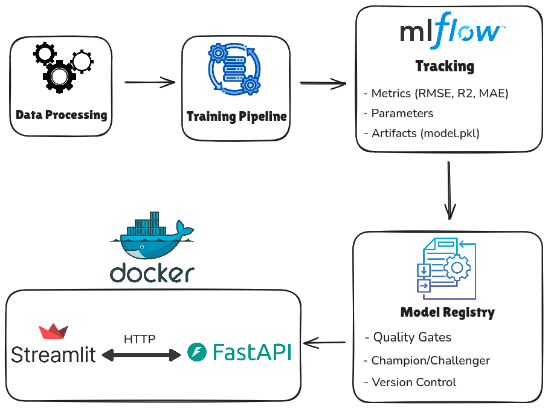
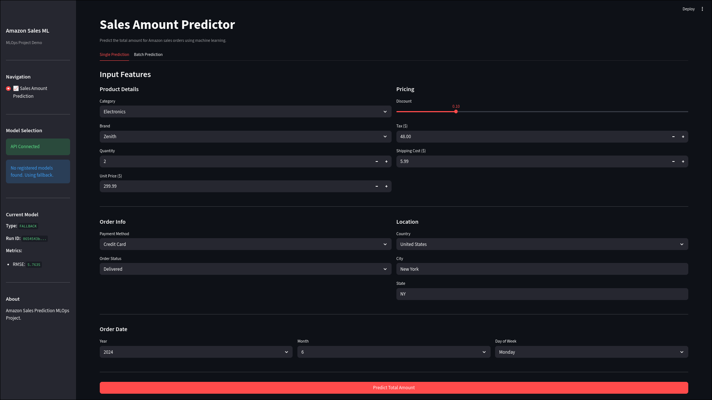

<p align="center">
  <h1 align="center">Amazon Sales MLOps</h1>
  <p align="center">
    <strong>End to End Machine Learning Operations Pipeline for Sales Prediction</strong>
  </p>
</p>

<p align="center">
  <a href="https://python.org"></a>
  <a href="https://mlflow.org"></a>
  <a href="https://fastapi.tiangolo.com"></a>
  <a href="https://xgboost.readthedocs.io"></a>
  <a href="https://scikit-learn.org"></a>
  <a href="https://pandas.pydata.org"></a>
  <a href="https://pydantic.dev"></a>
  <a href="https://pytest.org"></a>
  <a href="https://streamlit.io"></a>
  <a href="https://docker.com"></a>
</p>


<p align="center">
  <em>Predict sales amounts with machine learning and deploy with confidence using MLOps best practices</em>
</p>

---

## Table of Contents.

1. [Overview](#1-overview)
   - 1.1 [The Business Problem](#11-the-business-problem)
   - 1.2 [The Technical Solution](#12-the-technical-solution)
   - 1.3 [Key Capabilities](#13-key-capabilities)
2. [Project Structure](#2-project-structure)
   - 2.1 [Directory Layout](#21-directory-layout)
   - 2.2 [Core Components](#22-core-components)
3. [System Architecture](#3-system-architecture)
   - 3.1 [Pipeline Overview](#31-pipeline-overview)
   - 3.2 [Data Flow](#32-data-flow)
   - 3.3 [Component Interactions](#33-component-interactions)
4. [Features](#4-features)
   - 4.1 [Experiment Tracking with MLflow](#41-experiment-tracking-with-mlflow)
   - 4.2 [Model Registry and Champion Challenger Pattern](#42-model-registry-and-champion-challenger-pattern)
   - 4.3 [FastAPI Prediction Service](#43-fastapi-prediction-service)
   - 4.4 [Streamlit Dashboard](#44-streamlit-dashboard)
   - 4.5 [Docker Containerization](#45-docker-containerization)
5. [Quick Start](#5-quick-start)
   - 5.1 [Prerequisites](#51-prerequisites)
   - 5.2 [Installation with uv](#52-installation-with-uv)
   - 5.3 [Installation with pip](#53-installation-with-pip)
   - 5.4 [Training Models](#54-training-models)
   - 5.5 [Registering Best Models](#55-registering-best-models)
   - 5.6 [Starting the API](#56-starting-the-api)
   - 5.7 [Launching the UI](#57-launching-the-ui)
6. [Model Performance](#6-model-performance)
   - 6.1 [Approach to Finding the Best Model](#61-approach-to-finding-the-best-model)
   - 6.2 [Understanding the Metrics](#62-understanding-the-metrics)
   - 6.3 [Train vs Test RMSE Analysis](#63-train-vs-test-rmse-analysis)
   - 6.4 [Predictions vs True Values Analysis](#64-predictions-vs-true-values-analysis)
   - 6.5 [Residual Analysis](#65-residual-analysis)
   - 6.6 [Why XGBoost Dominated](#66-why-xgboost-dominated)
   - 6.7 [Quality Gates and Automated Model Selection](#67-quality-gates-and-automated-model-selection)
   - 6.8 [Key Learnings from the Experiment](#68-key-learnings-from-the-experiment)
7. [MLflow Experiment Tracking](#7-mlflow-experiment-tracking)
   - 7.1 [Experiment Dashboard](#71-experiment-dashboard)
   - 7.2 [Tracked Metrics](#72-tracked-metrics)
   - 7.3 [Logged Artifacts](#73-logged-artifacts)
   - 7.4 [Viewing the MLflow UI](#74-viewing-the-mlflow-ui)
8. [API Reference](#8-api-reference)
   - 8.1 [Base URL](#81-base-url)
   - 8.2 [Health Check](#82-health-check)
   - 8.3 [Model Information](#83-model-information)
   - 8.4 [Single Prediction](#84-single-prediction)
   - 8.5 [Batch Prediction](#85-batch-prediction)
   - 8.6 [Model Management](#86-model-management)
   - 8.7 [Interactive Documentation](#87-interactive-documentation)
9. [Docker Deployment](#9-docker-deployment)
   - 9.1 [Using Docker Compose](#91-using-docker-compose)
   - 9.2 [Using Docker Hub](#92-using-docker-hub)
   - 9.3 [Including MLflow UI](#93-including-mlflow-ui)
10. [Testing](#10-testing)
    - 10.1 [Running Tests](#101-running-tests)
    - 10.2 [Test Coverage](#102-test-coverage)
11. [Configuration](#11-configuration)
    - 11.1 [General Configuration](#111-general-configuration)
    - 11.2 [Registry Configuration](#112-registry-configuration)
    - 11.3 [Environment Variables](#113-environment-variables)
12. [Tech Stack](#12-tech-stack)

---

## 1. Overview

### 1.1 The Business Problem

E commerce platforms generate millions of transactions daily, and accurately predicting the total sales amount for each order is fundamental to inventory planning, revenue forecasting, and dynamic pricing strategies. The challenge lies in capturing the complex relationships between various order attributes, from product characteristics and customer demographics to temporal patterns and promotional discounts.

This project addresses the prediction of `TotalAmount` for Amazon sales orders by leveraging a comprehensive feature set that includes product attributes such as Category, Brand, and UnitPrice, order details including Quantity, Discount, Tax, and ShippingCost, customer location data spanning City, State, and Country, and temporal features like OrderYear, OrderMonth, and OrderDayOfWeek.

### 1.2 The Technical Solution

The solution centers on an XGBoost regression model that achieves remarkable accuracy with an R squared value of 0.9999 and an RMSE of just 5.76 on the test set. This model is deployed as a production ready API with full champion and challenger model management, enabling safe model transitions and A/B testing capabilities.

> [!NOTE]
> ### Why Machine Learning for a Deterministic Problem?
> You'll notice the model achieves near perfect accuracy with an R² of 0.9999. This is not coincidental. The TotalAmount in this dataset follows a deterministic pricing formula:
>
> `TotalAmount ≈ (Quantity × UnitPrice × (1 - Discount)) + Tax + ShippingCost`
>
> In a production system with a known formula, you would compute this value directly. So why did I choose machine learning?
>
> When I designed this project, my goal was to build a complete, production grade MLOps pipeline that demonstrates how machine learning systems should be engineered, deployed, and maintained in real world environments.
>
> Consider a scenario where you're working with a complex pricing engine and the underlying formula is unknown, proprietary, or changes frequently based on business rules. The formula might incorporate hidden factors like customer segments, promotional campaigns, regional pricing adjustments, or dynamic pricing algorithms that downstream systems cannot access. In such scenarios, treating the pricing engine as a black box and approximating its behavior with machine learning becomes a practical and valid solution.
>
> By framing this as a regression task, I was able to implement the complete MLOps lifecycle: experiment tracking with MLflow, automated model selection through quality gates, champion and challenger deployment patterns, REST API serving with FastAPI, interactive monitoring with Streamlit, and containerized deployment with Docker.

### 1.3 Key Capabilities

The pipeline implements industry standard MLOps practices through several interconnected systems. Experiment tracking ensures all training runs are logged to MLflow with complete metrics, parameters, and artifacts. The model registry implements a champion and challenger pattern for versioning and deployment management. Quality gates provide automated model validation before any model reaches production. The REST API delivers a FastAPI powered prediction service with comprehensive Swagger documentation. An interactive UI built with Streamlit enables real time predictions and model monitoring. Finally, containerization through Docker ensures seamless deployment across environments.

---

## 2. Project Structure

### 2.1 Directory Layout

```
amazon-sales-mlops/
├── README.md                              # This file
├── requirements.txt                       # Python dependencies
├── pyproject.toml                         # Project configuration
├── uv.lock                                # Dependency lock file
├── Dockerfile                             # Container definition
├── docker-compose.yml                     # Multi-container orchestration
│
├── configs/                               # Configuration files
│   ├── config.yaml                        # General settings
│   ├── registry.yaml                      # Model registry and quality gates
│   ├── best_model.yaml.example            # Template for best model reference
│   └── best_model.yaml                    # Best model reference (gitignored)
│
├── data/
│   ├── raw/                               # Original dataset
│   │   └── amazon_sales.csv
│   └── processed/                         # Feature engineered data
│       └── amazon_sales_regression.csv
│
├── models/                                # Exported models
│   └── champion.pkl                       # Production model (gitignored)
│
├── mlruns/                                # MLflow experiment artifacts (gitignored)
│
├── notebooks/                             # Jupyter notebooks
│   ├── 01_eda.ipynb                       # Exploratory Data Analysis
│   └── 02_model_baselines.ipynb           # Model experimentation
│
├── scripts/                               # Automation scripts
│   ├── run_train.py                       # Model training pipeline
│   ├── run_api.py                         # Start FastAPI server
│   ├── run_ui.py                          # Start Streamlit UI
│   ├── run_mlflow_ui.py                   # Start MLflow dashboard
│   ├── register_best_models.py            # Model registry automation
│   ├── select_best_regression_run.py      # Best model selection
│   └── export_model.py                    # Export model for Docker
│
├── src/amazon_sales_ml/                   # Main package
│   ├── __init__.py
│   ├── config.py                          # Path configurations
│   │
│   ├── api/                               # REST API
│   │   └── app.py                         # FastAPI application
│   │
│   ├── models/                            # ML components
│   │   ├── train.py                       # Training logic
│   │   ├── pipelines.py                   # Sklearn pipelines
│   │   └── evaluate.py                    # Evaluation utilities
│   │
│   ├── mlflow_utils/                      # Experiment tracking
│   │   └── tracking.py                    # MLflow helpers
│   │
│   └── ui/                                # Streamlit interface
│       ├── app.py                         # Main app
│       ├── api_client.py                  # API client
│       └── views/                         # UI pages
│           └── regression.py              # Regression view
│
├── tests/                                 # Unit tests
│   ├── conftest.py                        # Test fixtures
│   ├── test_api.py                        # API tests
│   └── test_model.py                      # Model tests
│
└── assets/                                # Documentation images
    ├── dashboard_ui.png                   # Streamlit UI screenshot
    ├── mlops_pipeline_archt.png           # Pipeline architecture diagram
    ├── pred_vs_true.png                   # Predictions vs true values plot
    ├── residuals.png                      # Residual analysis plot
    ├── train_vs_test_rmse.png             # Train vs test RMSE comparison
    └── mlflow/
        └── 01_runs_sorted_by_rmse_r2.png  # MLflow dashboard screenshot
```

### 2.2 Core Components

The project is organized around several key modules that work together to form the complete MLOps pipeline. The `src/amazon_sales_ml/models/` directory contains the training logic, scikit learn pipelines, and evaluation utilities that form the core machine learning functionality. The `src/amazon_sales_ml/api/` directory houses the FastAPI application that serves predictions in production. The `src/amazon_sales_ml/ui/` directory provides the Streamlit based interface for interactive model exploration. The `scripts/` directory contains automation scripts that orchestrate the various pipeline stages, from training through deployment.

---

## 3. System Architecture

### 3.1 Pipeline Overview



*The complete MLOps pipeline showing data flow from processing through training, experiment tracking, model registry, and deployment via containerized FastAPI and Streamlit services.*

### 3.2 Data Flow

The pipeline processes data through a series of well defined stages. Data ingestion loads and validates the raw CSV dataset. Feature engineering extracts temporal features and constructs encoding pipelines. Model training runs multiple algorithms in parallel with hyperparameter tuning. Experiment tracking logs all runs to MLflow with complete reproducibility information. Model selection applies quality gates to filter and rank candidate models. Registry management assigns champion and challenger aliases to the best performing models. Deployment serves predictions through the FastAPI endpoint. Monitoring provides visibility through the Streamlit UI for ongoing model interaction and observation.

### 3.3 Component Interactions

The architecture is designed around loose coupling between components. The training pipeline writes directly to MLflow, which serves as the single source of truth for all experiment metadata. The registration script reads from MLflow and writes to the model registry, applying quality gates in the process. The API can load models either from the registry using aliases or from exported pickle files for containerized deployments. The Streamlit UI communicates exclusively through the API, ensuring a clean separation between the presentation layer and the prediction service.

---

## 4. Features

### 4.1 Experiment Tracking with MLflow

Every training run is automatically logged to MLflow, creating a comprehensive audit trail of the model development process. This includes automatic logging of all training runs with timestamps, duration, and source information. Metric comparison across experiments enables systematic evaluation of different approaches. Artifact versioning preserves models, plots, and configuration files for each run. Run search and filtering capabilities make it easy to find specific experiments based on metrics or parameters.

### 4.2 Model Registry and Champion Challenger Pattern

The model registry implements a sophisticated versioning strategy that supports safe model transitions. The configuration in `configs/registry.yaml` defines the quality gates and alias management:

```yaml
registry:
  regression_model_name: amazon_sales_totalamount_regressor
  
  # Quality Gates
  min_test_r2: 0.90          # Minimum R2 threshold
  max_test_rmse: 250.0       # Maximum RMSE allowed
  max_generalization_gap_pct: 150.0  # Overfitting guard
  
  # Model Aliases
  champion_alias: champion   # Best production model
  challenger_alias: challenger  # Second best for A/B testing
```

### 4.3 FastAPI Prediction Service

The API provides a complete interface for model inference with several endpoints. Single predictions are available via the `/predict` endpoint for individual order scoring. Batch predictions through `/predict_batch` enable efficient processing of multiple orders. Model switching between champion and challenger versions supports A/B testing scenarios. Auto generated Swagger documentation at `/docs` provides interactive API exploration.

### 4.4 Streamlit Dashboard

The interactive dashboard offers a user friendly interface for model interaction. Real time predictions with form inputs allow immediate feedback on individual orders. Batch upload via CSV enables processing of larger datasets. Model status monitoring displays the currently loaded model and its performance metrics. Champion and challenger selection provides easy switching between registered model versions.



*The Streamlit dashboard provides an intuitive interface for making predictions, displaying model information, and monitoring API connectivity status.*

### 4.5 Docker Containerization

The project includes complete containerization support for production deployment:

```bash
# Start all services
docker-compose up

# Access:
# API: http://localhost:8000
# UI:  http://localhost:8501
```

---

## 5. Quick Start

### 5.1 Prerequisites

The project requires Python 3.13 or later. The recommended package manager is uv from Astral, though pip works as well.

### 5.2 Installation with uv

```bash
# Clone the repository
git clone https://github.com/yourusername/amazon-sales-mlops.git
cd amazon-sales-mlops

# Install dependencies
uv sync

# Activate virtual environment
source .venv/bin/activate
```

### 5.3 Installation with pip

```bash
# Clone the repository
git clone https://github.com/yourusername/amazon-sales-mlops.git
cd amazon-sales-mlops

# Create virtual environment
python -m venv .venv
source .venv/bin/activate

# Install dependencies
pip install -r requirements.txt
pip install -e .
```

### 5.4 Training Models

```bash
# Run the training pipeline
uv run python scripts/run_train.py

# View results in MLflow UI
uv run python scripts/run_mlflow_ui.py
# Open http://localhost:5000
```

### 5.5 Registering Best Models

```bash
# Select best model (generates configs/best_model.yaml)
uv run python scripts/select_best_regression_run.py

# Register to Model Registry with quality gates
uv run python scripts/register_best_models.py
```

> [!IMPORTANT]
> ### First Time Setup
> The `configs/best_model.yaml` file is not included in the repository because it contains references to local MLflow runs that are specific to each environment. After cloning the repository and running the training pipeline, execute `scripts/select_best_regression_run.py` to generate this file. See `configs/best_model.yaml.example` for the expected structure.

### 5.6 Starting the API

```bash
# Start FastAPI server
uv run python scripts/run_api.py

# API available at http://localhost:8000
# Swagger docs at http://localhost:8000/docs
```

### 5.7 Launching the UI

```bash
# Start Streamlit dashboard
uv run python scripts/run_ui.py

# UI available at http://localhost:8501
```

---

## 6. Model Performance

### 6.1 Approach to Finding the Best Model

When starting this project, the central question was clear: which algorithm would deliver the most reliable predictions for sales amounts? Rather than selecting a popular algorithm and hoping for the best, the approach was to test multiple methods, measure them fairly, and let the data determine the winner.

The experiment involved four different regression algorithms, each with distinct strengths and underlying philosophies, all trained on identical data with the same 80/20 train test split. No tricks, no cherry picking, just a fair head to head comparison.

The results were decisive:

| Model | Train RMSE | Test RMSE | Test R2 | Status |
|-------|-----------|-----------|---------|--------|
| **XGBoost** | 0.47 | 5.76 | 0.9999 | Champion |
| HistGradientBoosting | 8.41 | 17.80 | 0.9994 | Challenger |
| Linear Regression | 217.20 | 217.19 | 0.9094 | Below threshold |
| Random Forest | 51.03 | 130.75 | 0.3194 | Below threshold |

The numbers speak clearly, but there is considerably more to this story than a simple table. The following sections walk through what each visualization revealed about model behavior.

### 6.2 Understanding the Metrics

Before examining the visualizations, it helps to understand what these numbers actually represent in practical terms.

**RMSE (Root Mean Square Error)** measures average prediction error in the same units as the target variable, in this case dollars. When XGBoost shows an RMSE of 5.76, it means predictions typically miss the actual sale amount by about $5.76. For a system predicting amounts ranging from $50 to $3,500, this level of accuracy is exceptional.

**R2 (R squared)** indicates what percentage of variance in sales amounts the model can explain. An R2 of 0.9999 means XGBoost explains 99.99% of why one sale is $200 and another is $2,000. The remaining 0.01% represents random variation that no model could reasonably predict.

**The Train Test Gap** deserves close attention. When a model performs exceptionally on training data but poorly on test data, it has memorized the training examples rather than learning underlying patterns. This phenomenon, called overfitting, is a significant warning sign that demands investigation.

### 6.3 Train vs Test RMSE Analysis


*Comparison of training and test RMSE across all four models, revealing overfitting patterns and generalization capabilities.*

This visualization was the first one created, and it immediately revealed important information about each model's behavior.

The goal was to find short bars indicating low error that were roughly the same height for both train and test sets. Such a pattern would indicate a model that is both accurate and generalizes well to unseen data.

**Linear Regression** shows two tall bars sitting at nearly identical heights, around $217 error for both train and test. At first glance, this consistency might seem positive. However, this is actually the problem: the model is consistently bad. It is not overfitting, it is underfitting. Linear Regression assumes relationships between features and target are linear, but sales amounts do not work that way. Discounts kick in at certain quantities, taxes multiply with price, shipping costs vary by weight tiers. A straight line cannot capture any of these dynamics. The model is simply too simple for real world complexity.

**Random Forest** caught attention for troubling reasons. The gap between train RMSE around $51 and test RMSE shooting up to $130 is classic overfitting. Random Forest built hundreds of decision trees that together memorized the training data beautifully, but when shown new orders it had never seen, it stumbled. Those trees learned the quirks and noise of the training set rather than true underlying patterns. In production, this model would provide false confidence.

**HistGradientBoosting** showed promise. Both bars are low, $8.41 train and $17.80 test, with a small but reasonable gap. This model learned real patterns without memorizing noise. This one could be trusted.

**XGBoost** delivered exceptional results. Train RMSE of $0.47 and test RMSE of $5.76 are both remarkably small. Yes, there is a gap between them, but when test error is only $5.76 on predictions ranging up to $3,500, the gap becomes irrelevant. This model absolutely nailed the task. The near zero training error demonstrates full capture of data structure, and the tiny test error confirms this was not mere memorization but genuine learning of how sales amounts work.

### 6.4 Predictions vs True Values Analysis


*Scatter plots comparing predicted values against actual values for each model on the test set. Perfect predictions would fall exactly on the diagonal line.*

Numbers in a table provide one perspective. This visualization shows how each model performs across the entire range of sales amounts. Every test prediction is plotted against its true value. If a model were perfect, all points would fall exactly on the diagonal line.

**Linear Regression** in the top left is difficult to examine. The points form a scattered cloud that vaguely trends upward with massive spread throughout. Even worse, on the left side of the plot some predictions go negative. The model is predicting negative sales amounts for low value orders, which makes no sense whatsoever. Negative sales are impossible. This is what happens when forcing a linear relationship onto non linear data. The model captures general direction but misses everything that actually matters.

**Random Forest** in the top right shows improvement, but troubling patterns remain. The points form horizontal bands, and for high value orders above $2,500, the model consistently undershoots. It predicts $2,800 when actual sale was $3,200. This is overfitting manifesting visually. The model learned specific patterns from training data that do not fully translate to new data, especially at the extremes.

**HistGradientBoosting** in the bottom left demonstrates what good performance looks like. Points form a tight line hugging the diagonal. Low value orders are accurate. High value orders are still accurate. Consistency across the entire range indicates the model genuinely understands the relationship between features and sales amounts. This is what proper generalization looks like.

**XGBoost** in the bottom right required zooming in to see individual points because they overlap with the diagonal so precisely. It is almost uncanny how accurate this is. From $50 orders to $3,500 orders, XGBoost nails virtually every single prediction. The points do not just cluster around the line, they practically are the line. This level of accuracy exceeded initial expectations.

### 6.5 Residual Analysis


*Residual plots showing prediction errors (true minus predicted) against predicted values. Ideal residuals are randomly scattered around zero with no visible patterns.*

Prediction accuracy matters, but understanding how each model fails provides deeper insight. Are errors random, which is acceptable, or systematic, which indicates problems?

Residuals, calculated as true value minus predicted value, are plotted against predicted values. In an ideal scenario, a random scatter of points centered on zero with no patterns would appear. Any shapes or trends indicate the model has blind spots.

**Linear Regression** in the top left reveals the fundamental problem. Residuals form a distinctive bowtie shape, fanning out from center. Errors range from negative $600 to positive $1,000 depending on prediction range. More importantly, there is a clear curved pattern. For mid range predictions between $500 and $1,500, the model systematically underestimates. For very high predictions, errors swing wildly in both directions. This is not random noise, it is structural failure. The model literally cannot capture the true relationship because it is constrained to be linear.

**Random Forest** in the top right shows a concerning funnel shape. The spread of residuals grows wider as predictions increase. This is called heteroscedasticity, meaning model reliability changes depending on price range. For a $500 prediction, errors are relatively contained. For a $2,500 prediction, errors could range from negative $400 to positive $1,000. This inconsistency would make the model frustrating in practice.

**HistGradientBoosting** in the bottom left performs much better. Residuals are compressed into a band roughly between negative $60 and positive $80, scattered randomly around zero. No bowtie, no funnel, no curves. A few outliers exist, but the vast majority of predictions have small, unpredictable errors. This is exactly the goal: errors that are just random noise rather than systematic failures.

**XGBoost** in the bottom right approaches perfection. Errors compress into a tight band from roughly negative $40 to positive $50, randomly distributed around zero across all prediction ranges. No patterns whatsoever. Whether XGBoost predicts $100 or $3,000, errors behave identically, remaining small and random. This indicates the model has no blind spots, no systematic biases, nothing predictably wrong with it.

### 6.6 Why XGBoost Dominated

After observing these results, understanding why XGBoost performed so much better than alternatives became important.

**The gradient boosting approach matters.** XGBoost does not build just one model, it builds hundreds of small decision trees in sequence. Each new tree specifically focuses on mistakes the previous trees made. It functions like a team where each member specializes in fixing what others got wrong. This iterative error correction is incredibly powerful for capturing complex patterns.

**Built in regularization prevents memorization.** Unlike Random Forest, XGBoost includes L1 and L2 regularization that penalizes overly complex trees. This acts as a brake, preventing the model from fitting every tiny fluctuation in training data. This explains why the XGBoost train to test gap is reasonable while the Random Forest gap is huge.

**Tree structures handle feature interactions naturally.** Sales amounts in this dataset depend on multiplicative relationships: Quantity times UnitPrice, with Discount reducing the total, Tax adding a percentage, ShippingCost adding a flat amount. Linear Regression can only do weighted sums, so it fundamentally cannot model these interactions. Decision trees split data in ways that naturally capture conditional logic like "if quantity greater than 5 AND unit price greater than $100, then..." This is exactly the kind of reasoning that drives real pricing.

**The data plays to XGBoost's strengths.** This dataset has a mix of numerical and categorical features with non linear relationships between them. That is XGBoost's home turf. For simpler datasets with truly linear relationships, Linear Regression might actually win. But for e commerce data with all its complexity, XGBoost is the right tool.

### 6.7 Quality Gates and Automated Model Selection

Manual model selection after every retraining is impractical. Quality gates provide automated checks that a model must pass before registration for production use.

```yaml
# A model must meet ALL of these criteria
min_test_r2: 0.90              # Must explain at least 90% of variance
max_test_rmse: 250.0           # Average error must be under $250
max_generalization_gap_pct: 150.0   # Train test gap cannot be too extreme
```

When the registration script runs, the following occurs:

**XGBoost** passes all checks. R2 of 0.9999 exceeds the threshold. RMSE of $5.76 is well under $250. Generalization gap is within limits. Registered as Champion.

**HistGradientBoosting** also passes. R2 of 0.9994 exceeds threshold. RMSE of $17.80 passes. Gap is acceptable. Registered as Challenger, serving as backup model for A/B testing.

**Linear Regression** has an R2 of 0.9094 that technically passes the 0.90 threshold, but the RMSE of $217 combined with structural problems visible in residual analysis make it unsuitable. The combination of metrics and visual analysis excluded it.

**Random Forest** fails immediately. R2 of only 0.3194 does not come close. RMSE of $130.75 also fails. This model does not approach production quality.

The champion challenger pattern means a backup is always available. If something goes wrong with XGBoost in production, switching to HistGradientBoosting happens instantly without retraining.

### 6.8 Key Learnings from the Experiment

**XGBoost earned its reputation.** With R2 of 0.9999 and RMSE of just $5.76, this model delivers predictions trustworthy enough for real business decisions. Residual analysis confirms no hidden problems exist, errors are small and random.

**Good training performance means nothing without test validation.** Random Forest looked impressive during training with RMSE of $51, but fell apart on test data. Deploying based on training metrics alone would have shipped a fundamentally unreliable model.

**Linear Regression has real limitations.** It is simple, interpretable, and often good enough. But for this problem with its multiplicative feature interactions and non linear relationships, it simply could not compete. Sometimes extra complexity is necessary.

**Visualizations reveal what metrics hide.** Residual plots showed why Linear Regression fails through systematic patterns, not just that it fails through high RMSE. This deeper understanding supported confidence in the final choice.

**Automated quality gates are worth the setup.** Retraining models no longer requires manual checking of each one. Gates ensure only production worthy models pass through, and the champion challenger system provides a safe fallback.

**The gap between HistGradientBoosting and XGBoost is not huge.** Both are excellent models. The main difference is that XGBoost achieves even lower error at the cost of slightly longer training time. For this dataset size, that tradeoff is absolutely worth it.

---

## 7. MLflow Experiment Tracking

### 7.1 Experiment Dashboard


*All training runs tracked with metrics, sorted by test_RMSE and test_R2. The dashboard shows run names, creation times, durations, and key performance metrics for systematic comparison.*

### 7.2 Tracked Metrics

The following metrics are logged for every training run:

- `train_RMSE`, `test_RMSE` representing Root Mean Square Error on training and test sets
- `train_R2`, `test_R2` representing Coefficient of Determination on training and test sets
- `train_MAE`, `test_MAE` representing Mean Absolute Error on training and test sets

### 7.3 Logged Artifacts

Each run preserves the following artifacts:

- `model.pkl` containing the serialized scikit learn pipeline
- `conda.yaml`, `requirements.txt` specifying environment dependencies
- `input_example.json` providing a sample input for model serving

### 7.4 Viewing the MLflow UI

```bash
uv run python scripts/run_mlflow_ui.py
# Open http://localhost:5000
```

---

## 8. API Reference

### 8.1 Base URL

```
http://localhost:8000
```

### 8.2 Health Check

```http
GET /health
```

Response:
```json
{"status": "ok"}
```

### 8.3 Model Information

```http
GET /model-info
```

Response:
```json
{
  "source": "exported_pickle",
  "model_uri": "/app/models/champion.pkl",
  "run_id": "9c38d8f57d0944fbb965b2344b5117a4",
  "metrics": {"test_RMSE": 5.7635}
}
```

### 8.4 Single Prediction

```http
POST /predict
Content-Type: application/json

{
  "Category": "Electronics",
  "Brand": "Zenith",
  "Quantity": 2,
  "UnitPrice": 299.99,
  "Discount": 0.1,
  "Tax": 48.0,
  "ShippingCost": 5.99,
  "PaymentMethod": "Credit Card",
  "OrderStatus": "Delivered",
  "City": "New York",
  "State": "NY",
  "Country": "United States",
  "OrderYear": 2024,
  "OrderMonth": 6,
  "OrderDayOfWeek": "Monday"
}
```

Response:
```json
{"predicted_total_amount": 593.97}
```

### 8.5 Batch Prediction

```http
POST /predict_batch
Content-Type: application/json

[
  {...order1...},
  {...order2...}
]
```

Response:
```json
{"predictions": [593.97, 1205.43]}
```

### 8.6 Model Management

List all available models:
```http
GET /models
```

Load a specific model by alias:
```http
POST /models/load?alias=challenger
```

### 8.7 Interactive Documentation

Visit `http://localhost:8000/docs` for the Swagger UI, which provides interactive API exploration and testing capabilities.

---

## 9. Docker Deployment

### 9.1 Using Docker Compose

Docker Compose provides the recommended approach for deployment:

```bash
# Build and start all services
docker-compose up --build

# Services:
# API: http://localhost:8000
# UI:  http://localhost:8501

# Stop services
docker-compose down
```

### 9.2 Using Docker Hub

Pre built images are available from Docker Hub:

```bash
# Pull pre built image
docker pull familorujov/amazon-sales-mlops:v1.0

# Run API
docker run -p 8000:8000 familorujov/amazon-sales-mlops:v1.0

# Run UI
docker run -p 8501:8501 familorujov/amazon-sales-mlops:v1.0 \
  python -m streamlit run src/amazon_sales_ml/ui/app.py \
  --server.port 8501 --server.address 0.0.0.0
```

### 9.3 Including MLflow UI

```bash
# Start with MLflow UI included
docker-compose --profile full up

# MLflow UI: http://localhost:5000
```

---

## 10. Testing

### 10.1 Running Tests

```bash
# Run all tests
uv run pytest

# Run with verbose output
uv run pytest -v

# Run specific test file
uv run pytest tests/test_api.py
```

### 10.2 Test Coverage

The test suite covers the following areas:

**API Tests** verify health check endpoints, prediction endpoints for both single and batch requests, and model loading functionality.

**Model Tests** validate model loading, inference execution, and output format correctness.

---

## 11. Configuration

### 11.1 General Configuration

The `configs/config.yaml` file contains general application settings including data paths, target column specification, and training parameters.

### 11.2 Registry Configuration

The `configs/registry.yaml` file defines model registry behavior:

```yaml
mlflow:
  tracking_uri: null  # Uses local ./mlruns
  experiment_name: amazon_sales_regression

registry:
  regression_model_name: amazon_sales_totalamount_regressor
  
  # Quality Gates
  min_test_r2: 0.90
  max_test_rmse: 250.0
  max_generalization_gap_pct: 150.0
  
  # Top models to register
  register_top_k: 2
  
  # Aliases
  champion_alias: champion
  challenger_alias: challenger

metadata:
  dataset_id: amazon_sales_regression_v1
  data_path: data/processed/amazon_sales_regression.csv
```

### 11.3 Environment Variables

| Variable | Description | Default |
|----------|-------------|---------|
| `API_URL` | FastAPI base URL | `http://localhost:8000` |
| `MLFLOW_TRACKING_URI` | MLflow server URI | `./mlruns` |
| `DOCKER_MODE` | Enable Docker optimizations | `false` |

---

## 12. Tech Stack

| Category | Technology |
|----------|------------|
| **Language** | Python 3.13 |
| **ML Framework** | scikit learn, XGBoost, LightGBM |
| **Experiment Tracking** | MLflow 3.7.0 |
| **API** | FastAPI, Uvicorn, Pydantic |
| **UI** | Streamlit |
| **Data** | Pandas, NumPy, PyArrow |
| **Visualization** | Matplotlib, Seaborn |
| **Containerization** | Docker, Docker Compose |
| **Package Management** | uv (Astral) |
| **Testing** | pytest |
